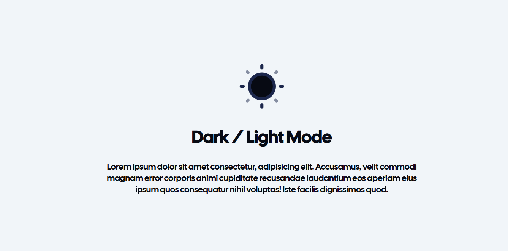
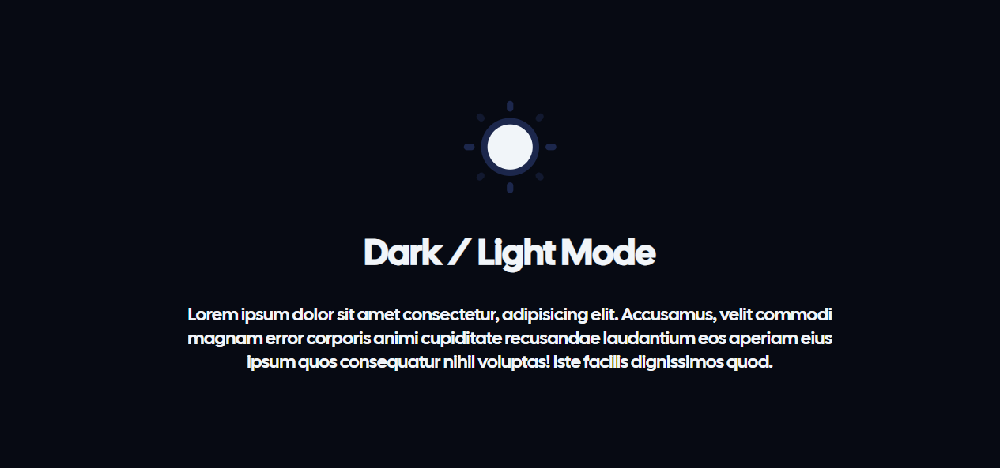

# DarkMode - Toggle 🌓

En este proyecto se creo un _Toggle_ de cambio de tema entre light y dark.

---

## 🚀 Características

- 🔄️ Actualiza el **Theme** del navegador con un botón.

---

## 🛠️ Construido con

  

---

## 🌐 Live demo

🧷[Ver DarkMode](https://keen-alpaca-3efdf3.netlify.app/)

---

## 🖼️ Vista previa

Un print de pantalla del proyecto:




---

## 📁 Estructura del proyecto

```
DARK MODE/
│
├── index.html # Main HTML file
├── image-1.png
└── style.css
└── app.js
```
